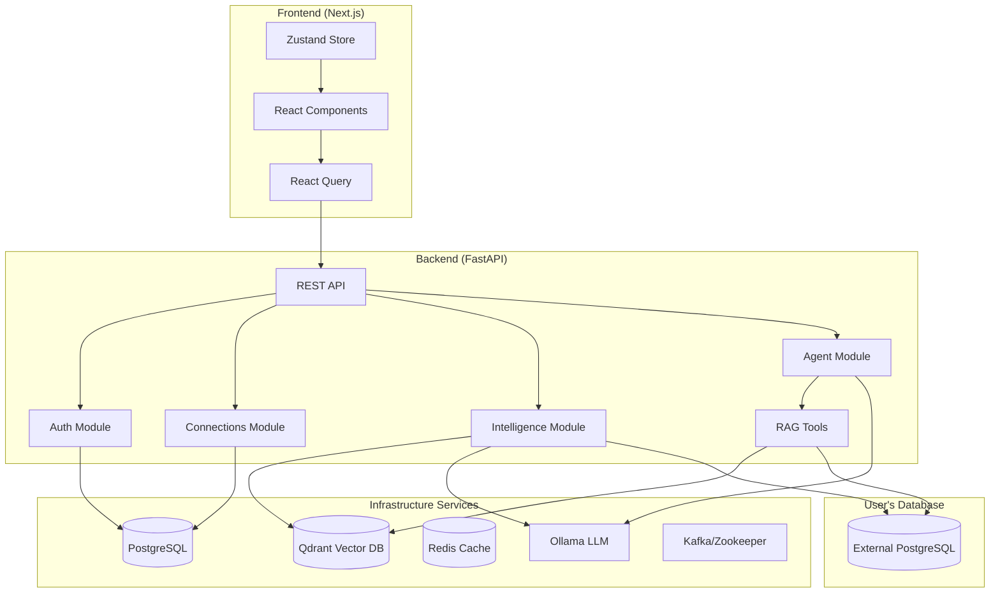

# Architecture Overview

## System Overview

The **Database RAG & Analytics Platform** is a production-ready application that enables users to connect PostgreSQL databases, automatically analyze their schema and metadata using AI, and interact with their data through natural language queries. The system uses a multi-agent architecture powered by LangGraph and vector search for intelligent data retrieval.

## High-Level Architecture



## Component Overview

### Frontend Layer
- **Next.js 14** with App Router for server-side rendering and routing
- **React Query** for server state management and caching
- **Zustand** for client state management (authentication)
- **Tailwind CSS + Shadcn UI** for styling and components

### Backend Layer
- **FastAPI** for high-performance async API
- **SQLModel** (SQLAlchemy + Pydantic) for ORM and validation
- **LangGraph** for multi-step agent workflows
- **Sentence Transformers** for embedding generation

### Infrastructure Layer
- **PostgreSQL 15**: System database for users, connections, insights
- **Qdrant**: Vector database for semantic search
- **Ollama**: Local LLM inference (qwen2.5:3b)
- **Redis**: Caching and session storage
- **Kafka + Zookeeper**: Message queue (prepared for future async processing)

## Data Flow

### 1. Database Connection Flow
```
User → Frontend → API → Connections Module → Test Connection → PostgreSQL (User's DB)
                                            ↓
                                      Save to System DB
                                            ↓
                                      Trigger Analysis
```

### 2. Analysis Flow
```
Analysis Trigger → Intelligence Service
                        ↓
                   Extract Metadata (asyncpg)
                        ↓
                   Generate Documents
                        ↓
                   Determine Indexing Strategy (LLM)
                        ↓
                   Create Embeddings (Sentence Transformers)
                        ↓
                   Store in Qdrant
```

### 3. Chat Query Flow
```
User Question → Agent Router → LangGraph Agent
                                     ↓
                              Understand Node (LLM)
                                     ↓
                              Retrieve Node (Vector Search)
                                     ↓
                              Generate Node (SQL + Execute)
                                     ↓
                              Response with Data
```

## Security Architecture

### Authentication
- **JWT-based** authentication with configurable expiration
- **bcrypt** password hashing
- Tokens stored in localStorage (frontend)

### Database Credentials
- **Fernet encryption** for stored database passwords
- Encryption key derived from JWT secret

### Access Control
- **Owner**: Full access to connection settings
- **View**: Access to Ask DB + Intelligence tabs
- **Chat**: Access only to Ask DB tab

## Directory Structure

```
sql-indexing/
├── backend/                    # FastAPI Backend
│   └── app/
│       ├── main.py            # Application entry point
│       ├── config.py          # Configuration management
│       ├── database.py        # SQLAlchemy setup
│       ├── agent/             # LangGraph chat agent
│       ├── auth/              # Authentication module
│       ├── connections/       # Database connections
│       ├── intelligence/      # Schema analysis engine
│       ├── rag/               # RAG tools and retrieval
│       ├── system/            # System management
│       └── users/             # User management
│
├── frontend/                   # Next.js Frontend
│   └── src/
│       ├── app/               # App Router pages
│       ├── components/        # React components
│       ├── lib/               # API client, auth store
│       └── hooks/             # Custom React hooks
│
├── docker-compose.yml          # Development orchestration
├── Makefile                   # Build and run commands
└── docs/                      # Documentation
```

## Technology Stack Summary

| Layer | Technology | Purpose |
|-------|------------|---------|
| Frontend | Next.js 14 | React framework with SSR |
| Frontend | React Query | Server state management |
| Frontend | Zustand | Client state management |
| Frontend | Tailwind CSS | Utility-first CSS |
| Backend | FastAPI | Async HTTP API framework |
| Backend | SQLModel | ORM with Pydantic validation |
| Backend | LangGraph | Agent workflow orchestration |
| Backend | Sentence Transformers | Text embeddings |
| AI | Ollama | Local LLM inference |
| Database | PostgreSQL | System and user databases |
| Vector DB | Qdrant | Semantic similarity search |
| Cache | Redis | Session and data caching |

## Key Design Decisions

1. **Async-first**: All database operations use `asyncpg` and `asyncio` for non-blocking I/O
2. **Local LLM**: Ollama enables private, on-premise LLM without external API calls
3. **Vector Search**: Qdrant provides fast semantic search for table/column discovery
4. **Multi-tenant**: Connection sharing with granular permissions
5. **Progressive Analysis**: Background analysis with progress tracking
