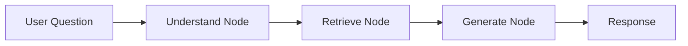

# Backend Modules

This document provides detailed documentation for each backend module, including their responsibilities, key classes, and how they interact with other modules.

---

## Table of Contents

1. [Main Application (main.py)](#main-application)
2. [Configuration (config.py)](#configuration)
3. [Database (database.py)](#database)
4. [Auth Module](#auth-module)
5. [Users Module](#users-module)
6. [Connections Module](#connections-module)
7. [Intelligence Module](#intelligence-module)
8. [Agent Module](#agent-module)
9. [RAG Module](#rag-module)
10. [System Module](#system-module)

---

## Main Application

**File**: `app/main.py`

Entry point for the FastAPI application.

### Responsibilities
- Initialize FastAPI application with metadata
- Configure CORS middleware
- Register all routers with prefixes
- Handle application lifecycle (startup/shutdown)

### Key Components

```python
@asynccontextmanager
async def lifespan(app: FastAPI):
    await init_db()  # Create tables on startup
    yield
    await close_db()  # Close connections on shutdown
```

### Routers Registered

| Prefix | Router | Tags |
|--------|--------|------|
| `/auth` | auth_router | Authentication |
| `/users` | users_router | Users |
| `/connections` | connections_router | Database Connections |
| `/intelligence` | intelligence_router | Intelligence Engine |
| `/chat` | agent_router | Chat Agent |
| `/system` | system_router | System |

---

## Configuration

**File**: `app/config.py`

Centralized configuration using Pydantic Settings.

### Key Settings Categories

#### Application Settings
- `app_name`: Application display name
- `app_version`: Current version
- `debug`: Debug mode flag
- `environment`: development/staging/production

#### Database Settings
- `database_url`: PostgreSQL connection string (async)
- Supports `pool_size` and `max_overflow` configuration

#### AI/ML Settings
- `ollama_base_url`: Ollama server URL
- `ollama_model`: Model name (default: `qwen2.5:3b`)
- `embedding_model`: Sentence transformer model

#### Analysis Settings
- `category_threshold`: Max distinct values for categorical (100)
- `sample_size`: Sample rows for high-cardinality columns (50)
- `reanalysis_interval_hours`: Auto re-analysis interval (168h)

### Usage

```python
from app.config import get_settings
settings = get_settings()  # Cached singleton
```

---

## Database

**File**: `app/database.py`

SQLModel/SQLAlchemy async database configuration.

### Key Components

#### Engine Configuration
```python
engine = create_async_engine(
    str(settings.database_url),
    echo=settings.debug,
    pool_pre_ping=True,
    pool_size=10,
    max_overflow=20,
)
```

#### Session Management

**FastAPI Dependency**:
```python
async def get_session() -> AsyncGenerator[AsyncSession, None]:
    async with async_session_maker() as session:
        try:
            yield session
            await session.commit()
        except Exception:
            await session.rollback()
            raise
```

**Context Manager** (for background tasks):
```python
async with get_session_context() as session:
    # Use session outside of request context
```

---

## Auth Module

**Directory**: `app/auth/`

### Files
- `router.py` - API endpoints
- `service.py` - Business logic
- `schemas.py` - Pydantic models
- `dependencies.py` - FastAPI dependencies

### API Endpoints

| Method | Endpoint | Description |
|--------|----------|-------------|
| POST | `/auth/register` | Register new user |
| POST | `/auth/login` | Login and get JWT token |
| GET | `/auth/me` | Get current user profile |
| POST | `/auth/refresh` | Refresh JWT token |

### Key Functions

#### Password Hashing
```python
pwd_context = CryptContext(schemes=["bcrypt"], deprecated="auto")

def verify_password(plain_password: str, hashed_password: str) -> bool
def get_password_hash(password: str) -> str
```

#### JWT Token Management
```python
def create_access_token(data: dict, expires_delta: timedelta | None = None) -> str
def decode_access_token(token: str) -> TokenData | None
```

### Dependencies

```python
# Get current authenticated user
CurrentUser = Annotated[User, Depends(get_current_user)]

# Get optional authenticated user
OptionalUser = Annotated[User | None, Depends(get_optional_user)]
```

---

## Users Module

**Directory**: `app/users/`

### Data Model

```python
class User(SQLModel, table=True):
    id: int | None
    username: str          # Unique, indexed
    email: str             # Unique, indexed
    hashed_password: str
    is_active: bool = True
    is_superuser: bool = False
    created_at: datetime
    updated_at: datetime
    
    # Relationships
    connections: list["DatabaseConnection"]
    shared_connections: list["ConnectionShare"]
```

### API Endpoints

| Method | Endpoint | Description |
|--------|----------|-------------|
| GET | `/users/search` | Search users by username/email |
| PUT | `/users/me` | Update profile |
| POST | `/users/me/change-password` | Change password |

---

## Connections Module

**Directory**: `app/connections/`

Manages external database connections with encryption and sharing.

### Data Models

#### DatabaseConnection
```python
class DatabaseConnection(SQLModel, table=True):
    id: int | None
    name: str
    description: str | None
    
    # Connection details
    host: str
    port: int = 5432
    database: str
    username: str
    encrypted_password: str  # Fernet encrypted
    ssl_mode: str = "prefer"
    
    # Status tracking
    status: ConnectionStatus
    status_message: str | None
    last_analyzed_at: datetime | None
    analysis_progress: float  # 0-100
    
    # Relationships
    owner: User
    shares: list[ConnectionShare]
    insights: list[TableInsight]
```

#### ConnectionStatus Enum
```python
class ConnectionStatus(str, Enum):
    PENDING = "pending"      # Not yet analyzed
    ANALYZING = "analyzing"  # Currently being analyzed
    INDEXING = "indexing"    # Insights being indexed
    READY = "ready"          # Ready for queries
    ERROR = "error"          # Error during analysis
    UPDATING = "updating"    # Re-analysis in progress
```

#### SharePermission Enum
```python
class SharePermission(str, Enum):
    CHAT = "chat"   # Only Ask DB tab
    VIEW = "view"   # Ask DB + Intelligence tabs
    OWNER = "owner" # Full access
```

### Service Functions

#### Password Encryption
```python
def encrypt_password(password: str) -> str
def decrypt_password(encrypted: str) -> str
```

#### Connection Testing
```python
async def test_connection(
    host: str,
    port: int,
    database: str,
    username: str,
    password: str,
    ssl_mode: str = "prefer",
) -> tuple[bool, str, str | None]
    # Returns (success, message, server_version)
```

### API Endpoints

| Method | Endpoint | Description |
|--------|----------|-------------|
| GET | `/connections` | List user's connections |
| POST | `/connections` | Create new connection |
| POST | `/connections/from-url` | Create from connection URL |
| GET | `/connections/{id}` | Get connection details |
| PUT | `/connections/{id}` | Update connection |
| DELETE | `/connections/{id}` | Delete connection |
| POST | `/connections/{id}/test` | Test connection |
| POST | `/connections/{id}/reanalyze` | Trigger re-analysis |
| GET | `/connections/{id}/shares` | List shares |
| POST | `/connections/{id}/shares` | Add share |
| DELETE | `/connections/{id}/shares/{user_id}` | Remove share |

---

## Intelligence Module

**Directory**: `app/intelligence/`

Handles database schema analysis, insight generation, and vectorization.

### Files
- `router.py` - API endpoints
- `service.py` - Orchestration service
- `extractor.py` - Metadata extraction
- `indexer.py` - Indexing strategy decisions
- `vectorizer.py` - Embedding and vector storage

### Data Models

#### TableInsight
```python
class TableInsight(SQLModel, table=True):
    id: int | None
    connection_id: int
    schema_name: str
    table_name: str
    row_count: int
    summary: str | None          # AI-generated summary
    insight_document: str | None # Full document for vectorization
    vector_id: str | None        # Qdrant reference
```

#### ColumnMetadata
```python
class ColumnMetadata(SQLModel, table=True):
    id: int | None
    table_insight_id: int
    column_name: str
    data_type: str
    is_nullable: bool
    is_primary_key: bool
    is_foreign_key: bool
    foreign_key_ref: str | None
    distinct_count: int | None
    null_count: int | None
    indexing_strategy: IndexingStrategy
    categorical_values: str | None  # JSON array
    sample_values: str | None       # JSON array
```

#### IndexingStrategy Enum
```python
class IndexingStrategy(str, Enum):
    CATEGORICAL = "categorical"  # Low cardinality - store all values
    VECTOR = "vector"            # High cardinality - vector search
    SKIP = "skip"                # Not indexed (IDs, timestamps)
```

### Extractor (extractor.py)

Extracts schema information from PostgreSQL databases.

#### Data Classes
```python
@dataclass
class ColumnInfo:
    name: str
    data_type: str
    is_nullable: bool
    is_primary_key: bool = False
    is_foreign_key: bool = False
    foreign_key_ref: str | None = None
    distinct_count: int | None = None
    null_count: int | None = None
    categorical_values: list[str] | None = None
    sample_values: list[str] | None = None

@dataclass
class TableInfo:
    schema_name: str
    table_name: str
    row_count: int
    columns: list[ColumnInfo]
    primary_keys: list[str]
    foreign_keys: list[dict]
```

#### Key Functions
```python
async def extract_metadata(
    host, port, database, username, password,
    ssl_mode="prefer",
    progress_callback=None
) -> DatabaseMetadata

def table_to_document(table: TableInfo) -> str
    # Generates text document for vectorization
```

### Indexer (indexer.py)

Determines optimal indexing strategies using LLM or rules.

```python
def determine_indexing_strategy_rule_based(column: ColumnInfo) -> IndexingStrategy

async def determine_indexing_strategy_llm(
    column: ColumnInfo, 
    table_context: str
) -> tuple[IndexingStrategy, str]
    # Returns (strategy, reasoning)
```

### Vectorizer (vectorizer.py)

Handles embedding generation and Qdrant operations.

```python
def get_qdrant_client() -> QdrantClient
def get_embedding_model() -> SentenceTransformer

async def embed_text(text: str) -> list[float]
async def upsert_document(connection_id, table_name, schema_name, document, metadata) -> str
async def search_similar(query, connection_id=None, limit=5) -> list[dict]
async def delete_connection_documents(connection_id: int) -> None
```

### Service (service.py)

Orchestrates the full analysis workflow.

```python
async def analyze_database(connection_id: int) -> None:
    """
    Full database analysis workflow:
    1. Extract metadata from database
    2. Generate insights for each table
    3. Determine indexing strategies using LLM
    4. Store embeddings in Qdrant
    """
```

### API Endpoints

| Method | Endpoint | Description |
|--------|----------|-------------|
| GET | `/intelligence/{connection_id}/insights` | Get all table insights |
| GET | `/intelligence/{connection_id}/stats` | Get analysis statistics |
| PUT | `/intelligence/{connection_id}/insights/{id}` | Update insight |

---

## Agent Module

**Directory**: `app/agent/`

LangGraph-based multi-step agent for natural language database queries.

### Files
- `router.py` - API endpoints
- `graph.py` - LangGraph workflow
- `models.py` - Chat session models

### Agent Workflow



#### Understand Node
- Parses user intent using LLM
- Identifies data requirements, filters, aggregations
- Handles greetings specially

#### Retrieve Node
- Searches Qdrant for semantically similar tables
- Returns relevant table schemas and documents

#### Generate Node
- Generates SQL query using LLM
- Executes query on user's database
- Generates natural language explanation

### Agent State
```python
class AgentState(TypedDict):
    # Input
    question: str
    connection_id: int
    explain_mode: bool
    
    # Intermediate
    intent: str | None
    relevant_tables: list[dict] | None
    generated_sql: str | None
    
    # Output
    response: str | None
    sql_query: str | None
    explanation: str | None
    data: list[list] | None
    columns: list[str] | None
    error: str | None
```

### Chat Session Models
```python
class ChatSession(SQLModel, table=True):
    id: int | None
    connection_id: int
    title: str | None
    is_public: bool = False
    share_token: str | None
    created_at: datetime
    updated_at: datetime

class ChatMessage(SQLModel, table=True):
    id: int | None
    session_id: int
    role: str  # "user" or "assistant"
    content: str
    sql_query: str | None
    execution_time_ms: int | None
    row_count: int | None
    created_at: datetime
```

### API Endpoints

| Method | Endpoint | Description |
|--------|----------|-------------|
| POST | `/chat/{connection_id}` | Send chat message |
| GET | `/chat/{connection_id}/sessions` | List chat sessions |
| GET | `/chat/{connection_id}/sessions/{id}` | Get session history |
| DELETE | `/chat/{connection_id}/sessions/{id}` | Delete session |
| POST | `/chat/{connection_id}/sessions/{id}/share` | Toggle public sharing |
| GET | `/chat/public/{share_token}` | Get public chat (no auth) |

---

## RAG Module

**Directory**: `app/rag/`

Retrieval-Augmented Generation tools for database querying.

### Tools

#### search_database_data
```python
async def search_database_data(
    query: str,
    connection_id: int,
    limit: int = 5,
) -> str:
    """
    Search for relevant tables and columns based on semantic similarity.
    Returns JSON with matching tables, schemas, and relevance scores.
    """
```

#### execute_sql_query
```python
async def execute_sql_query(
    sql: str,
    connection_id: int,
    max_rows: int = 100,
) -> dict[str, Any]:
    """
    Execute a SQL query on the user's database.
    Returns dict with columns, rows, and metadata.
    """
```

### Connection Caching
```python
_connection_cache: dict[int, dict] = {}

def set_connection_details(connection_id: int, details: dict) -> None
def get_connection_details(connection_id: int) -> dict | None
```

---

## System Module

**Directory**: `app/system/`

System health and monitoring endpoints.

### API Endpoints

| Method | Endpoint | Description |
|--------|----------|-------------|
| GET | `/system/health` | Detailed health check |
| GET | `/system/connections/{id}/status` | Connection status |
| GET | `/system/connections/{id}/sql-history` | SQL query history |
| GET | `/system/stats` | System statistics |
