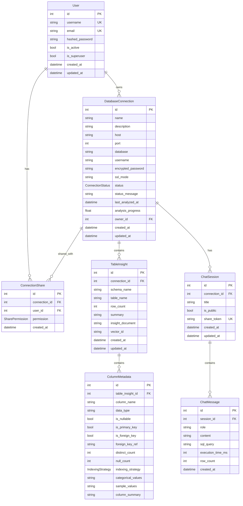

# Data Models Reference

This document provides a comprehensive reference for all data models used in the system, including database tables, enums, and their relationships.

---

## Entity Relationship Diagram



---

## Enums

### ConnectionStatus

Represents the current state of a database connection's analysis.

```python
class ConnectionStatus(str, Enum):
    PENDING = "pending"      # Just added, not yet analyzed
    ANALYZING = "analyzing"  # Currently being analyzed
    INDEXING = "indexing"    # Insights being indexed to vector store
    READY = "ready"          # Ready for queries
    ERROR = "error"          # Error during analysis/indexing
    UPDATING = "updating"    # Re-analysis in progress
```

| Status | Description | UI Indicator |
|--------|-------------|--------------|
| `pending` | Connection created but analysis not started | Yellow clock |
| `analyzing` | Metadata extraction in progress | Animated spinner |
| `indexing` | Generating embeddings and storing in Qdrant | Animated spinner |
| `ready` | Analysis complete, ready for queries | Green checkmark |
| `error` | Analysis failed with error | Red X |
| `updating` | Re-analysis triggered | Blue spinner |

### SharePermission

Defines access levels for shared database connections.

```python
class SharePermission(str, Enum):
    CHAT = "chat"   # Only Ask DB tab (General + Chat)
    VIEW = "view"   # Ask DB + Intelligence tabs
    OWNER = "owner" # Full access including Settings
```

| Permission | General Tab | Chat Tab | Intelligence Tab | Settings Tab |
|------------|-------------|----------|------------------|--------------|
| `chat` | ✓ | ✓ | ✗ | ✗ |
| `view` | ✓ | ✓ | ✓ | ✗ |
| `owner` | ✓ | ✓ | ✓ | ✓ |

### IndexingStrategy

Determines how a column is indexed for search.

```python
class IndexingStrategy(str, Enum):
    CATEGORICAL = "categorical"  # Low cardinality - store all values
    VECTOR = "vector"            # High cardinality - vector search
    SKIP = "skip"                # Not indexed (IDs, timestamps)
```

| Strategy | Use Case | Storage |
|----------|----------|---------|
| `categorical` | Enums, status fields, categories (<100 values) | All values in metadata |
| `vector` | Descriptions, names, comments (high cardinality) | Vector embeddings in Qdrant |
| `skip` | IDs, timestamps, foreign keys | Not indexed |

---

## Database Tables

### users

Stores user account information.

| Column | Type | Constraints | Description |
|--------|------|-------------|-------------|
| `id` | INTEGER | PK, AUTO | Primary key |
| `username` | VARCHAR(50) | UNIQUE, INDEX | Login username |
| `email` | VARCHAR(255) | UNIQUE, INDEX | Email address |
| `hashed_password` | VARCHAR(255) | NOT NULL | bcrypt hash |
| `is_active` | BOOLEAN | DEFAULT TRUE | Account active |
| `is_superuser` | BOOLEAN | DEFAULT FALSE | Admin privileges |
| `created_at` | TIMESTAMP | DEFAULT NOW | Creation time |
| `updated_at` | TIMESTAMP | DEFAULT NOW | Last update time |

### database_connections

Stores external database connection configurations.

| Column | Type | Constraints | Description |
|--------|------|-------------|-------------|
| `id` | INTEGER | PK, AUTO | Primary key |
| `name` | VARCHAR(100) | NOT NULL | Display name |
| `description` | VARCHAR(500) | NULL | Description |
| `host` | VARCHAR(255) | NOT NULL | Database host |
| `port` | INTEGER | DEFAULT 5432 | Database port |
| `database` | VARCHAR(100) | NOT NULL | Database name |
| `username` | VARCHAR(100) | NOT NULL | Database user |
| `encrypted_password` | VARCHAR(500) | NOT NULL | Fernet encrypted password |
| `ssl_mode` | VARCHAR(20) | DEFAULT 'prefer' | SSL mode |
| `status` | VARCHAR(20) | NOT NULL | ConnectionStatus enum |
| `status_message` | VARCHAR(500) | NULL | Status details |
| `last_analyzed_at` | TIMESTAMP | NULL | Last analysis time |
| `analysis_progress` | FLOAT | DEFAULT 0.0 | Progress 0-100 |
| `owner_id` | INTEGER | FK(users.id) | Owner reference |
| `created_at` | TIMESTAMP | DEFAULT NOW | Creation time |
| `updated_at` | TIMESTAMP | DEFAULT NOW | Last update time |

### connection_shares

Junction table for sharing connections with users.

| Column | Type | Constraints | Description |
|--------|------|-------------|-------------|
| `id` | INTEGER | PK, AUTO | Primary key |
| `connection_id` | INTEGER | FK(database_connections.id) | Connection reference |
| `user_id` | INTEGER | FK(users.id) | Shared user reference |
| `permission` | VARCHAR(20) | NOT NULL | SharePermission enum |
| `created_at` | TIMESTAMP | DEFAULT NOW | Share creation time |

### table_insights

Stores analyzed table information and insights.

| Column | Type | Constraints | Description |
|--------|------|-------------|-------------|
| `id` | INTEGER | PK, AUTO | Primary key |
| `connection_id` | INTEGER | FK(database_connections.id) | Connection reference |
| `schema_name` | VARCHAR(100) | DEFAULT 'public' | Database schema |
| `table_name` | VARCHAR(100) | NOT NULL | Table name |
| `row_count` | INTEGER | DEFAULT 0 | Approximate row count |
| `summary` | TEXT | NULL | AI-generated summary |
| `insight_document` | TEXT | NULL | Full document for vectorization |
| `vector_id` | VARCHAR(100) | NULL | Qdrant reference |
| `created_at` | TIMESTAMP | DEFAULT NOW | Creation time |
| `updated_at` | TIMESTAMP | DEFAULT NOW | Last update time |

### column_metadata

Stores analyzed column information.

| Column | Type | Constraints | Description |
|--------|------|-------------|-------------|
| `id` | INTEGER | PK, AUTO | Primary key |
| `table_insight_id` | INTEGER | FK(table_insights.id) | Table reference |
| `column_name` | VARCHAR(100) | NOT NULL | Column name |
| `data_type` | VARCHAR(100) | NOT NULL | PostgreSQL data type |
| `is_nullable` | BOOLEAN | DEFAULT TRUE | Nullable column |
| `is_primary_key` | BOOLEAN | DEFAULT FALSE | Part of PK |
| `is_foreign_key` | BOOLEAN | DEFAULT FALSE | Is FK reference |
| `foreign_key_ref` | VARCHAR(200) | NULL | FK target (table.column) |
| `distinct_count` | INTEGER | NULL | Distinct value count |
| `null_count` | INTEGER | NULL | NULL value count |
| `indexing_strategy` | VARCHAR(20) | DEFAULT 'skip' | IndexingStrategy enum |
| `categorical_values` | TEXT | NULL | JSON array of values |
| `sample_values` | TEXT | NULL | JSON array of samples |
| `column_summary` | TEXT | NULL | AI-generated summary describing the column |

### chat_sessions

Stores chat conversation sessions.

| Column | Type | Constraints | Description |
|--------|------|-------------|-------------|
| `id` | INTEGER | PK, AUTO | Primary key |
| `connection_id` | INTEGER | FK(database_connections.id) | Connection reference |
| `title` | VARCHAR(200) | NULL | Session title |
| `is_public` | BOOLEAN | DEFAULT FALSE | Publicly shareable |
| `share_token` | VARCHAR(64) | UNIQUE, NULL | Public share token |
| `created_at` | TIMESTAMP | DEFAULT NOW | Creation time |
| `updated_at` | TIMESTAMP | DEFAULT NOW | Last update time |

### chat_messages

Stores individual messages in chat sessions.

| Column | Type | Constraints | Description |
|--------|------|-------------|-------------|
| `id` | INTEGER | PK, AUTO | Primary key |
| `session_id` | INTEGER | FK(chat_sessions.id) | Session reference |
| `role` | VARCHAR(20) | NOT NULL | "user" or "assistant" |
| `content` | TEXT | NOT NULL | Message content |
| `sql_query` | TEXT | NULL | Generated SQL (assistant) |
| `execution_time_ms` | INTEGER | NULL | Query execution time |
| `row_count` | INTEGER | NULL | Result row count |
| `created_at` | TIMESTAMP | DEFAULT NOW | Message time |

---

## Pydantic Schemas

### Authentication Schemas

```python
class UserCreate(BaseModel):
    username: str = Field(..., min_length=3, max_length=50)
    email: EmailStr
    password: str = Field(..., min_length=8)

class UserResponse(BaseModel):
    id: int
    username: str
    email: str
    is_active: bool

class Token(BaseModel):
    access_token: str
    token_type: str = "bearer"
    expires_in: int

class TokenData(BaseModel):
    user_id: int
    username: str | None = None
```

### Connection Schemas

```python
class ConnectionCreate(BaseModel):
    name: str = Field(..., max_length=100)
    description: str | None = Field(None, max_length=500)
    host: str = Field(..., max_length=255)
    port: int = Field(5432, ge=1, le=65535)
    database: str = Field(..., max_length=100)
    username: str = Field(..., max_length=100)
    password: str
    ssl_mode: str = Field("prefer", pattern="^(disable|prefer|require)$")

class ConnectionResponse(BaseModel):
    id: int
    name: str
    description: str | None
    database: str
    host: str
    port: int
    status: ConnectionStatus
    status_message: str | None
    analysis_progress: float
    last_analyzed_at: datetime | None
    is_owner: bool
    permission: SharePermission | None
```

### Chat Schemas

```python
class ChatRequest(BaseModel):
    question: str = Field(..., min_length=1, max_length=2000)
    explain_mode: bool = Field(True)
    session_id: int | None = Field(None)

class ChatResponse(BaseModel):
    session_id: int
    message_id: int
    response: str
    sql: str | None
    explanation: str | None
    data: list | None
    columns: list[str] | None
    error: str | None
```

---

## Data Classes (Extractor)

### ColumnInfo

Represents metadata for a database column during extraction.

```python
@dataclass
class ColumnInfo:
    name: str                              # Column name
    data_type: str                         # PostgreSQL type
    is_nullable: bool                      # Allows NULL
    is_primary_key: bool = False           # Part of PK
    is_foreign_key: bool = False           # References another table
    foreign_key_ref: str | None = None     # "table.column"
    distinct_count: int | None = None      # Distinct values
    null_count: int | None = None          # NULL values
    categorical_values: list[str] | None = None  # All values if categorical
    sample_values: list[str] | None = None       # Sample if high cardinality
```

### TableInfo

Represents metadata for a database table during extraction.

```python
@dataclass
class TableInfo:
    schema_name: str              # Usually "public"
    table_name: str               # Table name
    row_count: int                # Approximate rows
    columns: list[ColumnInfo]     # Column metadata
    primary_keys: list[str]       # PK column names
    foreign_keys: list[dict]      # FK definitions
```

### DatabaseMetadata

Complete metadata for a database.

```python
@dataclass
class DatabaseMetadata:
    tables: list[TableInfo]       # All tables
    total_tables: int = 0         # Table count
    total_rows: int = 0           # Total row count
```

---

## Vector Store Payloads (Qdrant)

Documents stored in Qdrant include the following payload structure:

```json
{
  "connection_id": 1,
  "table_name": "users",
  "schema_name": "public",
  "document": "Table: public.users\nRow Count: 1,234\n\nColumns:\n- id: integer (PK)\n- username: character varying\n- email: character varying\n...",
  "row_count": 1234,
  "column_count": 8,
  "summary": "Table public.users | 1,234 rows | 8 columns"
}
```

The document text is embedded using `sentence-transformers/all-MiniLM-L6-v2` (384 dimensions).
